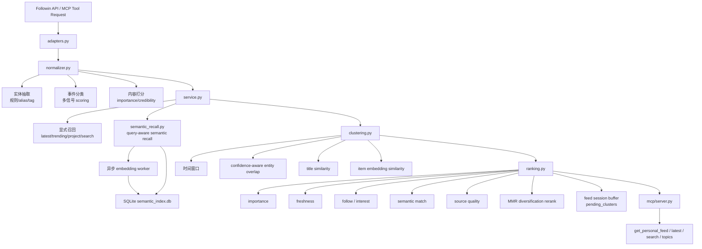

# followin-mcp

一个面向 crypto 场景的 Followin MCP 原型，当前重点是：

- 内容归一化
- 事件聚类
- 用户个性化推荐排序
- 推荐解释与调试
- 语义召回与异步 embedding 索引

## 目录结构

- `followin_mcp/`
  Python 包入口
- `followin_mcp/core/`
  核心业务逻辑：adapter、model、normalizer、ranking、service
- `followin_mcp/mcp/`
  MCP server 入口
- `followin_mcp/demo/`
  测试 agent 和 Web demo
- `scripts/debug_recommendation.py`
  推荐调试脚本
- `scripts/start_dev.sh`
  本地一键启动脚本
- `web/`
  前端静态资源

## 核心模块

- `followin_mcp/core/adapters.py`
  Followin API 适配层
- `followin_mcp/core/models.py`
  数据模型
- `followin_mcp/core/taxonomy_rules.py`
  taxonomy / 规则配置
- `followin_mcp/core/event_types.py`
  事件类型枚举
- `followin_mcp/core/normalizer.py`
  原始内容标准化、实体抽取、事件类型识别
- `followin_mcp/core/clustering.py`
  事件聚类
- `followin_mcp/core/ranking.py`
  用户推荐排序与解释
- `followin_mcp/core/semantic_recall.py`
  embedding 建索引、语义召回、item 相似度
- `followin_mcp/core/service.py`
  面向 MCP / 应用层的服务入口

## 架构总览



## 面试版摘要

这个项目可以概括成一条面向 crypto 资讯场景的轻量推荐链路：

- 上游通过 `Followin API + normalizer` 把原始内容标准化成结构化 item
- 中间通过 `explicit recall + semantic recall` 构建候选集
- 再通过 `multi-signal clustering` 把多篇内容并成事件簇
- 最后通过 `personalized ranking + MMR rerank` 生成用户级 feed

如果要一句话描述实现重点，可以这样讲：

> 我做了一个面向 crypto 资讯的事件级推荐原型，在线侧用规则和动态词典做低延迟内容理解，召回侧引入 query-aware embedding semantic recall，聚类侧融合时间、实体重叠和语义相似度，排序侧用多信号 heuristic ranker 加 MMR diversification 产出个性化 feed。

如果要一句话描述与生产的距离，可以这样讲：

> 当前实现已经覆盖了内容理解、召回、聚类、排序和解释的完整链路，但用户建模、learned ranking、cluster lifecycle 和 source reliability calibration 仍然是后续向生产演进的主要方向。

## 处理链路

### 1. 内容理解层

- `normalizer.py`
  - 基于 `tag + builtin alias + dynamic alias + keyword rules` 做实体抽取
  - 产出 `projects / tokens / chains / topics`
  - 产出 `entity_sources` 与 `entity_confidence`
  - 基于 `topic prior + lexical triggers + entity boosters` 做 event type scoring
  - 产出 `importance_score` 与 `credibility_score`

### 2. 召回层

- 显式召回
  - `latest headlines`
  - `trending feeds`
  - `project feed`
  - `search content`
- 语义召回
  - `semantic_recall.py`
  - 使用 `user profile + current query` 构造 query embedding
  - 候选 item embedding 存到 SQLite
  - 服务启动 warmup + 运行时增量 enqueue

### 3. 聚类层

- `clustering.py`
  - greedy incremental clustering
  - 先做 `event_type` 和时间窗口 gating
  - 再用多信号 cluster score 合并：
    - confidence-aware entity overlap
    - title Jaccard similarity
    - optional semantic similarity

### 4. 排序层

- `ranking.py`
  - cluster 级个性化排序
  - 使用的信号包括：
    - `importance_score`
    - `freshness_score`
    - `follow_affinity_score`
    - `interest_match_score`
    - `semantic_match_score`
    - `source_quality_score`
    - `risk_boost_score`
    - `mute_penalty`
  - 最后用 MMR 风格 rerank 做 diversification

## Tool 语义与上下文边界

大多数 MCP tools 默认保持**无状态**：

- `get_latest_headlines`
- `get_trending_feeds`
- `get_project_feed`
- `get_project_opinions`
- `get_trending_topics`
- `search_content`

这些 tool 会返回“当前时刻的原始结果”或“当前排序结果”，但**不会自动根据对话历史做去重、翻页或续看控制**。

`get_personal_feed` 是当前唯一的例外：

- 它会在 `service.py` 内维护一个短生命周期的 **feed session**
- 对外暴露的是一个轻量的 **feed session cursor**
- 服务端内部保存：
  - `source_cursors`
  - `delivered_event_ids`
  - `delivered_item_ids`
  - `pending_clusters`
- 后续“更多”请求会优先消费 session 里的 `pending_clusters`，更接近推荐流 continuation，而不是单纯的 offset 切页

对应的职责边界是：

- tool / service 层
  - 提供原始 retrieval / ranking 能力
  - 不隐式维护 session-level seen state
- agent 层
  - 负责利用对话历史和已有 tool 输出做多轮控制
  - 例如：
    - “展开刚才第二条”
    - “继续讲上一条”
    - “再来一批”
    - “换一批别重复的”

这样设计的原因是：

- 避免 tool 层把“推荐曝光控制”和“原始查询能力”混在一起
- 避免用户想继续分析上一轮结果时，被 session 级硬去重错误拦住
- 让多轮对话策略明确落在 agent policy，而不是埋在底层 service 里

当前分页语义如下：

- 已经暴露 cursor 的 tool：
  - `get_latest_headlines`
  - `get_trending_feeds`
  - `get_project_feed`
  - `get_project_opinions`
  - `get_trending_topics`
  - `search_content`
  - `get_personal_feed`
- 这些 tool 的返回里会带上可用的分页元信息，例如：
  - `cursor`
  - `next_cursor`
  - `last_cursor`
  - `has_more`
  - `has_next`
- agent 目前已经通过 prompt 明确承担上下文控制职责，可以在用户要求“更多 / 下一页”时复用这些 cursor
- 其中：
  - `get_latest_headlines / get_project_feed / get_project_opinions / get_trending_topics`
    优先透传上游 API 的真实 cursor
  - `get_trending_feeds / search_content`
    目前使用服务层 offset-cursor，对当前快照做稳定分页
  - `get_personal_feed`
    当前使用 feed session cursor；服务端会维护 `pending_clusters` 作为 snapshot-like queue，后续分页优先从 buffer 中返回，再按需补充新的候选与排序结果

## 当前使用到的技术 / 算法

- Python + MCP (`FastMCP`)
- Followin API adapter
- 规则式实体抽取
  - alias matching
  - source tag matching
  - keyword rules
- 事件分类
  - rule-based multi-signal scoring
- 实体置信度
  - `strong / medium / weak`
- 语义召回
  - OpenAI embedding
  - cosine similarity
  - SQLite 向量持久化
- 聚类
  - greedy incremental clustering
  - confidence-weighted Jaccard overlap
  - title Jaccard similarity
  - item embedding similarity
- 排序
  - heuristic linear ranker
  - MMR-style diversification rerank

## 与业界生产实现相比，还缺什么

### 召回 / 用户建模

- 还没有真正的 long-term / session user representation 分层
- 还没有行为日志驱动的异步用户画像更新
- 语义召回仍以单机 SQLite 为主，未接入专门向量库或 ANN 检索
- cursor / pagination 已经统一暴露到 MCP tools，但部分工具仍是服务层 offset-cursor，而不是上游 API 原生 cursor；`get_personal_feed` 虽然已经引入 feed session 与 `pending_clusters` buffer，但仍是内存态的轻量实现，距离生产常见的 Redis / snapshot store 方案还有差距

### 内容理解

- 实体抽取仍以规则和词典为主，缺少在线 NER / entity linking 主链路
- event taxonomy 仍偏冷启动规则系统，缺少标注数据驱动的校准
- credibility 仍是 source-type prior，缺少 source-level reliability 和 multi-source verification

### 聚类

- 当前是轻量多信号聚类，缺少更成熟的 online cluster assignment / pairwise classifier
- semantic similarity 已接入，但仍是启发式融合，缺少学习到的 merge model
- cluster 生命周期治理还较弱，缺少跨天演化、拆簇、合簇策略

### 排序

- 当前是 heuristic linear ranker，不是 learned-to-rank
- 缺少点击、停留时长、分享等行为特征
- 缺少线上 A/B 实验与 weight calibration
- diversification 目前是轻量 MMR，还缺更系统的配额控制和业务约束

## 当前暴露的 MCP Tools

- `get_latest_headlines`
- `get_trending_feeds`
- `get_project_feed`
- `get_project_opinions`
- `get_trending_topics`
- `search_content`
- `get_personal_feed`

## 运行调试脚本

```bash
python3 scripts/debug_recommendation.py
```

## Web Demo

如果你想更直观地测试“随机用户画像 + 多轮对话”，可以启动一个 Web demo：

```bash
python3 -m followin_mcp.demo.webapp
```

或者安装后：

```bash
followin-mcp-web
```

然后打开：

```text
http://127.0.0.1:8000
```

这个 demo 支持：

- 随机生成用户画像
- 为当前画像创建一个 LangChain agent session
- 在同一个 session 里保留多轮聊天上下文
- 为支持分页的 tool 保留最近可用的 `next_cursor` 上下文
- 展示每轮实际发生的一个或多个 tool 调用
- 展示 tool 参数和返回结果卡片

运行前请确保 `.env` 中已经配置：

```bash
FOLLOWIN_API_KEY=your_api_key
OPENAI_API_KEY=your_openai_api_key
```

## MCP Server

当前已经把以下能力暴露成 MCP tools：

- `get_latest_headlines`
- `get_trending_feeds`
- `get_project_feed`
- `get_project_opinions`
- `get_trending_topics`
- `search_content`
- `get_personal_feed`

启动方式：

```bash
python3 -m followin_mcp.mcp.server
```

或者安装后使用：

```bash
followin-mcp-server
```
