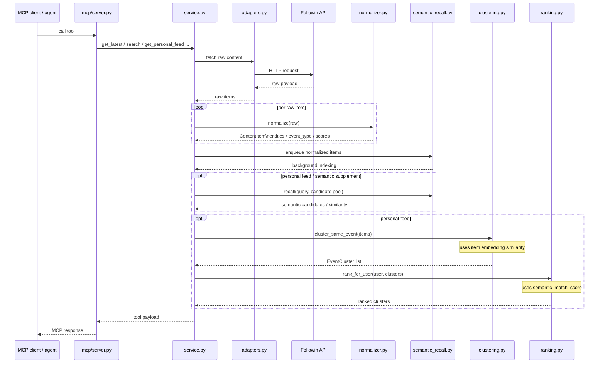

# Followin-MCP

## 项目概览

这个项目可以理解成一条面向 crypto 资讯场景的事件级推荐原型：

- 上游通过 `Followin API + adapters.py` 拉取原始内容
- `normalizer.py` 把原始内容标准化成结构化 `ContentItem`
- `service.py` 在 `get_personal_feed` 里先做显式多路召回，再做 semantic supplement
- `clustering.py` 把多条内容并成同一事件的 `EventCluster`
- `ranking.py` 用多信号 heuristic ranker + MMR rerank 生成个性化 feed

一句话总结：

> 一个面向 crypto 资讯场景的 Followin MCP 原型：将原始内容标准化成结构化 item，再通过多路召回、语义补召回、事件聚类和个性化排序，产出面向用户的事件级 feed。

## 目录结构

- `followin_mcp/`
  Python 包入口
- `followin_mcp/core/`
  核心业务逻辑：adapter、model、normalizer、ranking、service
- `followin_mcp/mcp/`
  MCP server 入口
- `followin_mcp/demo/`
  测试 agent 和 Web demo
- `scripts/start_dev.sh`
  本地一键启动脚本
- `web/`
  前端静态资源

## 核心模块

- `followin_mcp/core/adapters.py`
  Followin API 适配层
- `followin_mcp/core/models.py`
  数据模型
- `followin_mcp/core/taxonomy_rules.py`
  taxonomy / 规则配置
- `followin_mcp/core/normalizer.py`
  原始内容标准化、实体抽取、事件类型识别
- `followin_mcp/core/clustering.py`
  事件聚类
- `followin_mcp/core/ranking.py`
  用户推荐排序与解释
- `followin_mcp/core/semantic_recall.py`
  embedding 建索引、语义召回、item 相似度
- `followin_mcp/core/service.py`
  面向 MCP / 应用层的服务入口

## 请求处理时序



## 处理链路

### 1. MCP 入口

- `mcp/server.py`
  - 暴露 7 个 MCP tools
  - 把 MCP 入参转成 `service.py` 调用
  - 负责把 `ContentItem / EventCluster` 序列化成 MCP 返回结构

### 2. 原始内容获取

- `service.py -> adapters.py`
  - `get_latest_headlines / get_project_feed / get_project_opinions / get_trending_topics`
    直接透传上游分页能力
  - `get_trending_feeds / search_content`
    直接返回当前快照结果
  - `get_personal_feed`
    会先做显式多路召回和 semantic supplement，再走事件聚类和个性化排序

### 3. 内容标准化

- `normalizer.py`
  - `normalize(raw)` 把单条原始内容转成 `ContentItem`
  - 实体抽取来源：
    - tag
    - chain keyword
    - project alias
    - token alias
    - topic alias
    - dynamic alias（轻量化实体发现 / 旁路NER）
  - 产出：
    - `projects / tokens / chains / topics`
    - `entity_sources`
    - `entity_confidence(命中方式强度)`
    - `event_type`
    - `credibility_score(来源可信程度)`
    - `importance_score(预定规则计算)`

### 4. 召回

- 这里的“召回”指的是：
  - 先从更大的内容池里取出一批候选 `ContentItem`
  - 供后面的聚类、排序和分页使用
- `service.py` 在 personal feed 里会先做显式多路召回：
  - `latest`
  - `trending`
  - `project`
  - `search`
- 多路召回结果会先按 `item.id` 去重
  - 同一个 item 如果被多路命中，会优先保留 semantic match 更强、importance 更高、更新时间更近的那个版本

### 5. 事件聚类

- `clustering.py`
  - 输入是 `ContentItem` 列表
  - 输出是 `EventCluster` 列表
  - 聚类目标是“同一事件”，不是同一项目或同一 topic
  - 主要信号：
    - 事件类型兼容性
    - 时间窗口
    - 带置信度权重的实体重叠
    - 标题相似度
    - 可选的语义相似度

### 6. 个性化排序

- `ranking.py`
  - 输入是 `EventCluster`
  - 输出是按用户排序后的 cluster feed
  - 主要信号：
    - `importance_score`
    - `freshness_score`
    - `follow_affinity_score`
    - `interest_match_score`
    - `semantic_match_score`
    - `source_quality_score`
    - `risk_boost_score`
  - `mute_penalty`
  - 最后再做一层 MMR-style diversification rerank

### 7. Embedding

- `semantic_recall.py`
  - normalized item 会先 `enqueue` 到异步 embedding worker
  - item embedding 存在本地 SQLite `semantic_index.db`
- embedding 当前主要参与三件事：
  - `service.py` 在 personal feed 里基于当前 query 和候选池做 query-aware semantic recall / semantic supplement
  - `clustering.py` 把 item embedding similarity 作为聚类信号之一
  - `ranking.py` 通过 `semantic_match_score` 把语义匹配信号带入最终排序

## Personal Feed

- `get_personal_feed` 是当前唯一会话化的 feed tool
- 主流程是：
  - 显式多路召回
  - semantic supplement
  - 事件聚类
  - 个性化排序
- `service.py` 内部维护 `FeedSessionState`，主要保存：
  - `pending_clusters`
  - `delivered_event_ids`
  - `delivered_item_ids`
  - `source_cursors`
- 返回结果包含：
  - `ranked_clusters`
  - 展开的 supporting `items`
  - `next_cursor`
  - `has_more`
- 分页语义是：
  - 首次请求创建 feed session，并尽量把已排好序的 cluster 填进 `pending_clusters`
  - 当前页从 `pending_clusters` 头部取前 `max_items` 个 cluster
  - 已返回的 cluster / item 会记入 delivered 集合，避免后续重复
  - 后续“更多”优先继续消费剩余 `pending_clusters`
  - 当 buffer 低于 refill threshold 时，再触发下一轮召回、semantic supplement、聚类和排序来补 buffer

## Tool 语义与上下文边界

当前这套 MCP tools 可以分成两类：

- 内容查询工具
  - `get_latest_headlines`
  - `get_trending_feeds`
  - `get_project_feed`
  - `get_project_opinions`
  - `get_trending_topics`
  - `search_content`
- 推荐工具
  - `get_personal_feed`

内容查询工具默认保持无状态：

- `get_latest_headlines / get_project_feed / get_project_opinions / get_trending_topics`
  - 透传上游分页能力
  - 返回的是当前请求对应的一页结果
- `get_trending_feeds / search_content`
  - 直接返回当前快照结果
  - 不维护额外的服务层分页状态

`get_personal_feed` 是当前唯一的状态化 tool：

- `service.py` 会维护短生命周期的 `FeedSessionState`
- 对外只暴露 `feed session cursor`
- 服务端内部保存：
  - `pending_clusters`
  - `delivered_event_ids`
  - `delivered_item_ids`
  - `source_cursors`
- 后续“更多”会优先继续消费 session 里的 `pending_clusters`

职责边界大致是：

- tool / service 层
  - 提供内容获取、候选召回、聚类、排序和 feed session 管理
- agent 层
  - 负责多轮对话中的工具选择和上下文承接
  - 例如继续上一批、展开上一条、基于上一轮结果追问

当前分页语义：

- `get_latest_headlines / get_project_feed / get_project_opinions / get_trending_topics`
  - 返回上游原生 cursor 元信息
- `get_personal_feed`
  - 返回 `next_cursor` 和 `has_more`
  - `cursor` 的语义是 feed session continuation，而不是普通列表翻页

## 当前使用到的技术 / 算法

- Python + MCP (`FastMCP`)
- Followin API adapter
- 规则式实体抽取
  - alias matching
  - source tag matching
  - keyword rules
- 事件分类
  - rule-based multi-signal scoring
- 实体置信度
  - `strong / medium / weak`
- 语义召回
  - OpenAI embedding
  - cosine similarity
  - SQLite 向量持久化
- 聚类
  - greedy incremental clustering
  - confidence-weighted Jaccard overlap
  - title Jaccard similarity
  - item embedding similarity
- 排序
  - heuristic linear ranker
  - MMR-style diversification rerank

## 与业界生产实现相比，原型还缺什么

### 召回 / 推荐系统能力

- 推荐层还没有真正的 long-term / session user representation 分层
- 还没有行为日志驱动的异步用户画像更新链路

### 内容理解

- 当前已经有轻量化的实体发现 / 弱 NER（tag、alias、rule、LLM-assisted extraction），但还没有带 span offset 的通用在线 NER / entity linking 主链路
- event taxonomy 仍偏冷启动规则系统，缺少标注数据驱动的校准
- 当前 `credibility_score` 主要依赖上游提供的 source type / metadata；受数据边界限制，还没有更细的 source-level reliability 和 multi-source verification

### 聚类

- 当前已经把 embedding similarity 作为聚类信号之一，但整体仍是启发式多信号聚类，还没有训练式的 pairwise classifier / merge model
- 如果进一步演进到基于持久化 cluster store 的在线聚类体系，还需要补 cluster assignment，以及跨天演化、拆簇、合簇等 cluster lifecycle 能力

### 排序

- 当前排序已经用到 embedding 驱动的 `semantic_match_score`，但主体仍是人工特征加权的 heuristic linear ranker，而不是 learned-to-rank
- 推荐层还没有接入点击、停留时长、分享等行为特征
- 推荐层当前只做了轻量 MMR diversification，还没有更系统的配额控制和业务约束

## 当前暴露的 MCP Tools

- `get_latest_headlines`
- `get_trending_feeds`
- `get_project_feed`
- `get_project_opinions`
- `get_trending_topics`
- `search_content`
- `get_personal_feed`

## Web Demo

如果你想更直观地测试“随机用户画像 + 多轮对话”，可以启动一个 Web demo：

```bash
python3 -m followin_mcp.demo.webapp
```

或者安装后：

```bash
followin-mcp-web
```

然后打开：

```text
http://127.0.0.1:8000
```

这个 demo 支持：

- 随机生成用户画像
- 为当前画像创建一个 LangChain agent session
- 在同一个 session 里保留多轮聊天上下文
- 为支持分页的 tool 保留最近可用的 `next_cursor` 上下文
- 展示每轮实际发生的一个或多个 tool 调用
- 展示 tool 参数和返回结果卡片

运行前请确保 `.env` 中已经配置：

```bash
FOLLOWIN_API_KEY=your_api_key
OPENAI_API_KEY=your_openai_api_key
```

## MCP Server

当前已经把以下能力暴露成 MCP tools：

- `get_latest_headlines`
- `get_trending_feeds`
- `get_project_feed`
- `get_project_opinions`
- `get_trending_topics`
- `search_content`
- `get_personal_feed`

启动方式：

```bash
python3 -m followin_mcp.mcp.server
```

或者安装后使用：

```bash
followin-mcp-server
```
